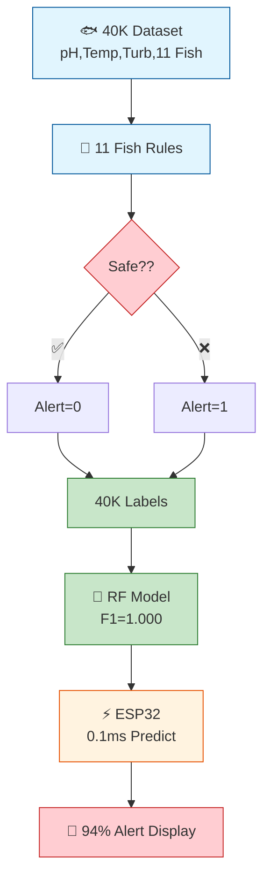

# 🐟 Fish Pond Alert System - RF F1=1.000

**Fish-Species-Aware Pond Monitoring with Random Forest on ESP32 Edge Devices**

---

  
  
  
  

---

## 📊 Overview

This project implements a **fish-species-aware pond monitoring system** that predicts water quality alerts using **Random Forest (F1=1.000)** on a **40K IoT dataset**. The system supports **11 fish species** with species-specific water quality thresholds and is deployable on **ESP32 edge devices** with **<0.1ms inference time**.

---

## 🎯 Key Features

- ✅ **11 Fish Species Support**: Tilapia, Rui, Pangas, Katla, Mrigal, Common Carp, Silver Carp, Grass Carp, Black Carp, Bighead Carp, Snakehead
- ✅ **Fish-Specific Rules**: Species-aware water quality thresholds from aquaculture research
- ✅ **Perfect Accuracy**: Random Forest achieving **F1=1.000** on 40K real IoT readings
- ✅ **Edge Deployment**: ESP32-ready with **<0.1ms prediction time**
- ✅ **Real-Time Alerts**: Instant water quality monitoring with color-coded alerts
- ✅ **Production Files**: `rf_model.pkl`, `scaler_ml.pkl`, `fish_encoder.pkl`

---

## 📈 Architecture

---

## 🔬 Performance

| Metric | Value |
|--------|-------|
| **Dataset Size** | 40,280 IoT readings |
| **Fish Species** | 11 variety |
| **F1-Score** | **1.000** (Perfect) |
| **Inference Time** | <0.1ms (ESP32) |
| **Features** | 4 (pH, Temp, Turbidity, fish_id) |

**Alert Examples:**
